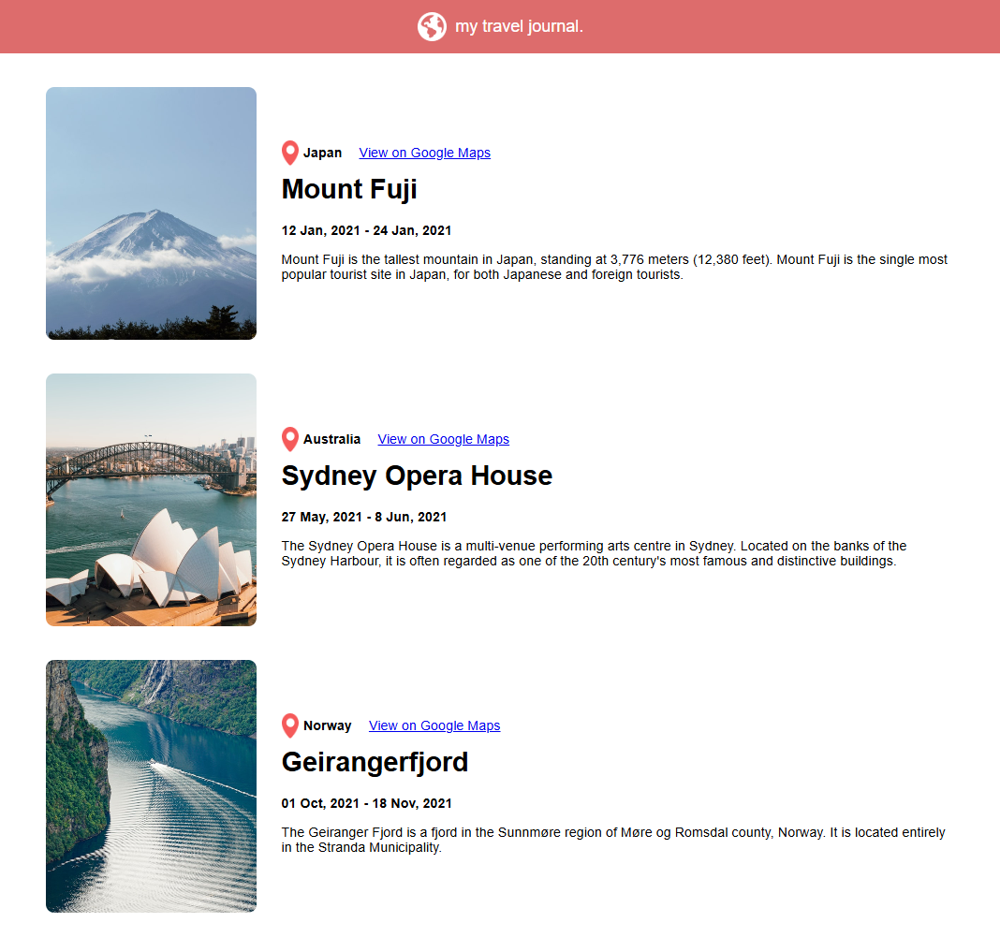

# 🌍 My Travel Journal

This is a personal travel journal web app I created by following [this React tutorial](https://www.youtube.com/watch?v=x4rFhThSX04&t=21934s) by Scrimba.

## 🛠 My Demo

## 🛠️ What I Learned

Through building this project, I deepened my understanding of:

- **React props** – I used props to pass travel destination data into individual card components, making them flexible and reusable.
- **Mapping arrays** – I used `Array.map()` to dynamically generate UI components from a data array, making the app scalable and easy to update.
- **Component design** – I learned how to break a UI into modular components and reuse them across different pieces of data.
- **Project structure and styling** – I practiced organizing a React project and applying custom CSS for layout and styling.

## 🚀 Features

- Displays travel destinations with image, location, dates, and a description.
- Each entry includes a link to view the location on Google Maps.
- Designed to be easily extendable — just add more entries to the data file!

## 🛠 How to Run Locally

1. Clone the repo
2. Navigate into the folder
3. Install dependencies  
   `npm install`
4. Start the dev server  
   `npm run dev`

> This project uses [Vite](https://vitejs.dev/) for fast setup and hot reloading.
